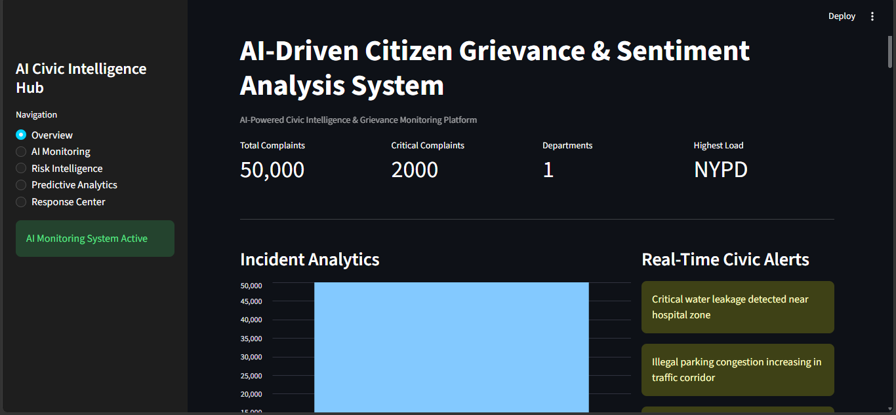
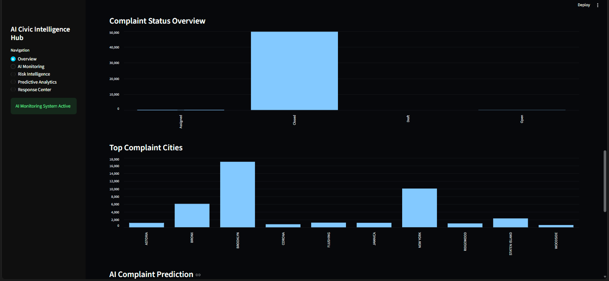
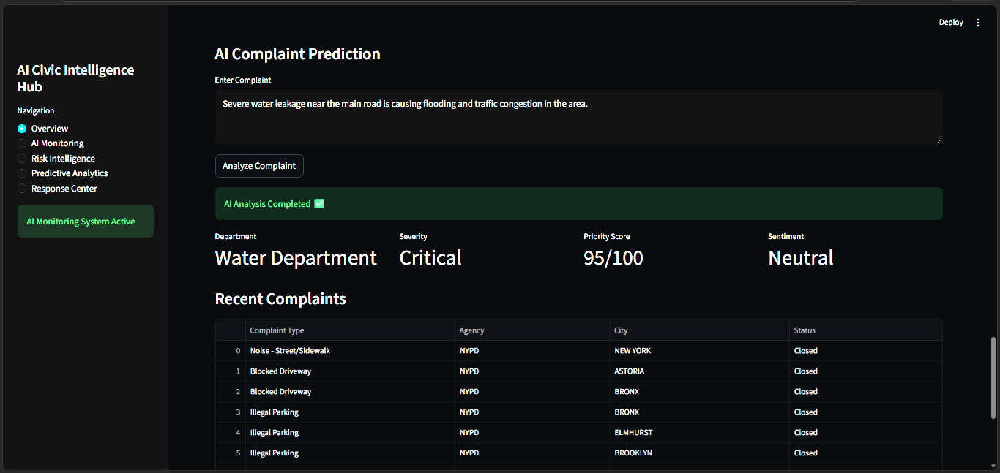
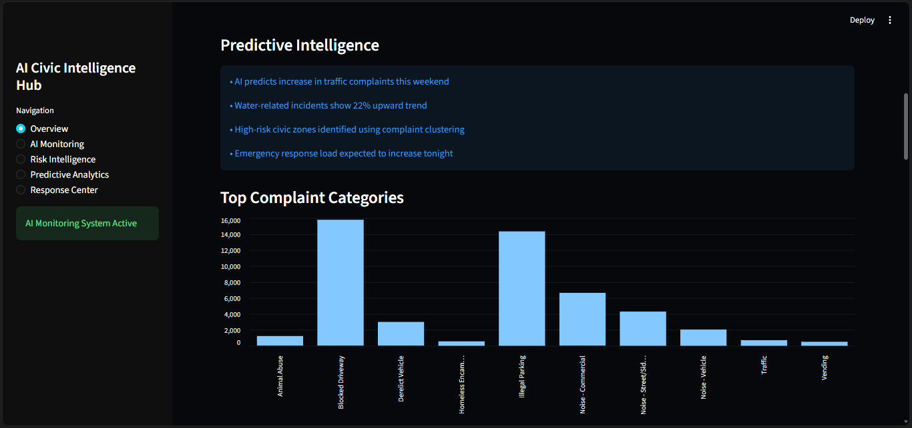
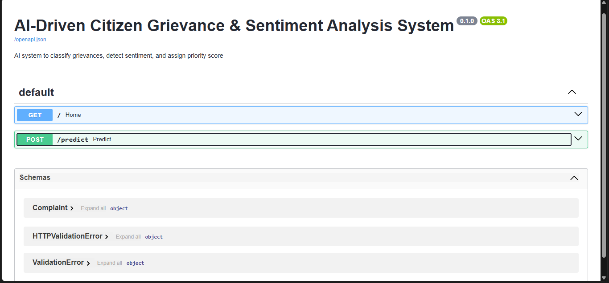

# 🚀 AI-Driven Citizen Grievance & Sentiment Analysis System

## 🌟 Overview

The **AI-Driven Citizen Grievance & Sentiment Analysis System** is an end-to-end AI-powered platform designed to automate the analysis of citizen complaints using **Machine Learning and Natural Language Processing (NLP)**.

It intelligently classifies grievances, detects sentiment, and provides interactive insights through dashboards. This system helps government and civic organizations improve response time, transparency, and decision-making efficiency.

---

## 🎯 Problem Statement

Traditional grievance systems rely heavily on manual processing, leading to:
- Slow response times
- Unstructured complaint handling
- Difficulty in analyzing large datasets
- Lack of actionable insights

---

## 💡 Proposed Solution

This system leverages AI to:
- Automatically classify complaints into categories
- Analyze sentiment (Positive / Negative / Neutral)
- Extract insights from large-scale grievance datasets
- Visualize trends using dashboards

---

## ⚙️ Key Features

✔ Automated grievance classification  
✔ Sentiment analysis using NLP  
✔ Data preprocessing & cleaning  
✔ Feature extraction using TF-IDF  
✔ Machine learning model training  
✔ Interactive dashboard (Streamlit)  
✔ FastAPI backend for predictions  
✔ Data visualization (Matplotlib/Seaborn)  

---

## 🧠 Tech Stack

**Languages:**  
- Python  

**Libraries:**  
- Pandas, NumPy  
- Scikit-learn  
- NLTK  
- Matplotlib, Seaborn  

**Frameworks:**  
- FastAPI  
- Streamlit  

---

## 📂 Project Structure
AI-Grievance-System/
│
├── data/
├── models/
├── notebooks/
├── outputs/
├── src/
├── app.py
├── dashboard.py
├── requirements.txt
└── README.md

---

## 📊 Workflow

1. Data Collection (NYC 311 Dataset)
2. Data Cleaning & Preprocessing
3. Feature Engineering (TF-IDF)
4. Model Training (ML Algorithms)
5. Sentiment Analysis
6. Dashboard Visualization
7. API Deployment using FastAPI

## 🚀 How to Run Locally
### Install dependencies
```bash
pip install -r requirements.txt
```

### Run API
```bash
uvicorn app:app --reload
```

### Run Dashboard
```bash
streamlit run dashboard.py
```
## 📸 Screenshots

### 🏠 Dashboard


### 📊 Complaints Overview


### 🔍 Complaint Prediction


### 🔝 Top Complaints Analysis


### ⚡ API Interface


## 📈 Results

- Accurate grievance classification
- Sentiment-based insights
- Faster complaint analysis
- Interactive visualization dashboards

---

## 🔮 Future Enhancements

- Real-time grievance tracking system
- Multi-language support
- Deep learning model integration
- Mobile application version

